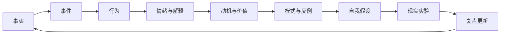

# AI Deep Talk

一套通过 AI 协作问答，从事实与证据出发，形成可验证自我假设的开源自我研究系统。

它不让 AI 判断“你是什么人”，而是帮助你回答：在什么情境下，我做过什么选择？我在保护、追求或回避什么？这些选择是否构成重复模式？我的理解能否被现实验证？

## 核心路径

## 九个模块

| 模块 | 任务 | 核心输出 |
|---|---|---|
| M0 | 设定边界与研究问题 | 启动卡 |
| M1 | 建立人生事实库 | 时间线、事件卡 |
| M2 | 选择高信息密度事件 | 主事件与选择理由 |
| M3 | 还原行为与决策过程 | 事件链、分岔点 |
| M4 | 拆分事实、情绪、解释与需求 | 四层拆分表 |
| M5 | 追问动机与价值排序 | 动机链、价值冲突 |
| M6 | 识别模式、矛盾与例外 | 模式证据表 |
| M7 | 形成可证伪的自我假设 | 假设卡 |
| M8 | 现实验证与持续更新 | 微实验、复盘记录 |

## 快速开始

1. 阅读 [安全与边界](docs/02-safety-and-boundaries.md)。
2. 复制 [单次会话模板](templates/session.md)。
3. 将 [总控 Prompt](prompts/system-prompt.md) 发给 AI。
4. 从 M0 开始，一次只研究一个具体问题。
5. 至少积累三个事件后再判断重复模式。
6. 所有结论都写成暂定假设，并通过现实实验更新。

## 这套系统不是什么

- 不是人格测试或 AI 算命；
- 不是心理诊断、治疗或危机干预；
- 不是让 AI 替你解释人生或做重大决定；
- 不是一次对话后生成一份永久不变的“人格报告”。

## 推荐使用节奏

- 单次会话：30–60 分钟，只完成一个阶段性任务；
- 素材期：收集 10–20 张事件卡；
- 深挖期：选择 3 个高信息密度事件；
- 建模期：形成 1–3 条低置信度假设；
- 验证期：连续 1–4 周进行低风险现实实验；
- 更新期：保留、修正、降低置信度或放弃假设。

## 隐私提醒

不要把真实个人资料、他人聊天记录、住址、工作机密或可识别的敏感事件提交到公开仓库。建议使用 `[城市 A]`、`[前公司]`、`[朋友 X]` 等占位符。个人记录目录应保持私有并加入 `.gitignore`。

## 文档导航

- [项目方法论](docs/00-methodology.md)
- [使用指南](docs/01-how-to-use.md)
- [安全与边界](docs/02-safety-and-boundaries.md)
- [AI 角色与对话协议](docs/03-ai-role-and-protocol.md)
- [九模块总览](docs/04-nine-modules.md)
- [总控 Prompt](prompts/system-prompt.md)
- [模块 Prompt](prompts/module-prompts.md)
- [白板与可视化建议](visual/whiteboard-guide.md)

## 许可建议

方法论与 Markdown 模板可采用 CC BY 4.0；若未来增加程序代码，可另为代码采用 MIT License。正式发布前请在仓库中加入相应许可全文。
