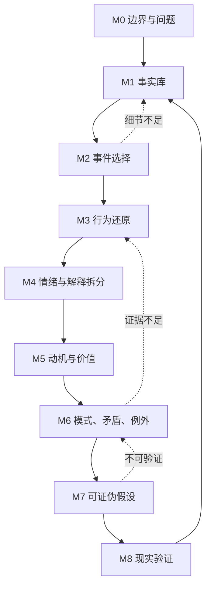

# 九模块总览

## 统一模块结构

每个模块都包含：目标、输入、步骤、AI 角色、提问逻辑、追问规则、停止或切换条件、输出物和质量检查。详细说明位于 `docs/modules/`。

## 信息流

## 关键门槛

| 从 | 到 | 门槛 |
|---|---|---|
| M0 | M1 | 问题具体、边界明确 |
| M1 | M2 | 至少有一个具体事件 |
| M2 | M3 | 选定一个主事件 |
| M3 | M4 | 触发—选择—行为—结果清晰 |
| M4 | M5 | 事实、情绪、解释已分离 |
| M5 | M6 | 至少两个事件可比较 |
| M6 | M7 | 有模式证据和至少一个反例 |
| M7 | M8 | 假设包含可观察预测 |
| M8 | 更新 | 获得新的现实证据 |
